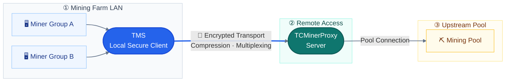

<div align="center">

<h1> TMS</h1>

[简体中文](../readme.md) | **English**

### A secure TCMinerProxy client for mining farm networks

Connect local miners through a single client, reduce public network traffic and outbound connections, and manage configuration and monitoring in one place.

**🔐 Encrypted Transport · 🗜️ Traffic Compression · 🔗 Connection Multiplexing · 📊 Monitoring**

[📥 Download Client](https://www.tcminerproxy.com/zh/download/tms-secure-client) · [📖 Documentation](https://www.tcminerproxy.com/zh/document/tcminerproxy) · [💻 GitHub Repository](https://github.com/MinerProxyPro/TMS) · [☁️ TCMinerProxy Server](https://github.com/MinerProxyPro/TCMinerProxy)

</div>

> **Requirement:** TMS works with a TCMinerProxy server. For smaller deployments with stable connectivity and sufficient bandwidth, miners can also connect directly to TCMinerProxy.

## 🧭 Contents

- [🌐 Overview](#overview)
- [🧰 Features](#features)
- [🔌 Choosing a Protocol](#protocols)
- [📦 Download and Installation](#installation)
- [⚙️ Initial Setup](#configuration)
- [📊 Operations and Maintenance](#operations)
- [🛠️ Frequently Asked Questions](#faq)
- [📚 Documentation and Repository](#resources)

<a id="overview"></a>

## 🌐 Overview

TMS typically runs on the mining farm's local network. Miners connect to the local TMS client, which connects to a remote TCMinerProxy server. The server then connects to the upstream mining pool.



By managing connections locally, TMS reduces public network traffic and outbound connection counts. It also supports configuration synchronization, load balancing across multiple remote addresses, and runtime monitoring.

<a id="features"></a>

## 🧰 Features

| Feature | Description |
| --- | --- |
| 🗜️ **Traffic compression** | Supports TMS3, TMS3(Zstd), and TMS3(NB) to reduce public network traffic |
| 🔗 **Connection multiplexing** | Consolidates connections from multiple miners into fewer outbound connections |
| 🔐 **Encrypted transport** | Connects to the TCMinerProxy server over a protected protocol link |
| 🔄 **Automatic synchronization** | Synchronizes port settings using the server's configuration push URL |
| ⚙️ **Manual configuration** | Configure local listening ports, remote servers, coins, protocols, and passwords |
| ⚖️ **Load balancing** | Assign multiple compatible remote addresses to a local port and distribute connections among them |
| 📊 **Monitoring** | View inbound and outbound connection counts, CPU usage, memory, network activity, and port status |
| 🛡️ **Dashboard access control** | Set login credentials and a custom secure access path |

<a id="protocols"></a>

## 🔌 Choosing a Protocol

Check the protocol used by the server port before configuring the client.

| Protocol | Use case | Notes |
| --- | --- | --- |
| `TMS3(NB)` | Large BTC and LTC deployments | Supports BTC and LTC only. The original project reports up to a 99.6% reduction in public network traffic under specific test conditions |
| `TMS3(Zstd)` | Balancing compression with CPU usage | Uses the same connection logic as TMS3, typically with lower CPU usage |
| `TMS3` | General high-compression use cases | Higher compression levels typically increase CPU load |
| `TMS2` | Connecting to legacy TMS2 server ports | Supports legacy deployments; TMS3 server ports are not backward compatible with TMS2 |

> **Configuration requirements:** The client and server must use matching coins, protocols, port passwords, and compression settings. Actual compression depends on the coin, miner protocol, connection count, compression parameters, and hardware. The figures above do not guarantee the same results in every deployment.

<a id="installation"></a>

## 📦 Download and Installation

### 🖥️ Supported Platforms

| Platform | Architecture or edition | Installation method |
| --- | --- | --- |
| Linux | x86-64 | Installation script |
| Linux / OpenWrt | ARMv7 | Installation script or manual download |
| Linux / OpenWrt | AArch64 | Installation script or manual download |
| Windows | x64 GUI | Download the GUI executable and required library |
| Windows | x64 command line | Download the console executable |

OpenWrt hardware and distributions vary considerably. Check your CPU architecture before deployment and verify compatibility with a small number of miners first.

### 🐧 Linux Installation

**Before you begin**

- Create and enable a TMS protocol port on the TCMinerProxy server.
- Assign a static LAN IP address to the device running TMS.
- Ensure you have `root` privileges. The commands below require Bash and curl.
- Read the system changes described below.

**System changes made by the installer**

The script installs TMS to `/root/tms`, configures the appropriate service or startup mechanism, and enables automatic startup at boot. It also adjusts file descriptor limits and attempts to disable the firewall on some Linux distributions. The current script skips automatic firewall disabling on OpenWrt.

> **Protect the management port:** Review the [installation script](https://github.com/MinerProxyPro/TMS/blob/main/install.sh) before running it. After installation, configure the firewall for your network so that only trusted LAN devices can access the management and miner listening ports. Avoid exposing the default management port, `42703`, to the public internet.

**Run the installer**

```bash
sudo -i
bash <(curl -s -L https://raw.githubusercontent.com/MinerProxyPro/TMS/main/install.sh)
```

If you are already logged in as `root`, run the second line directly. Follow the menu to select a download source and CPU architecture, then complete the installation. The script detects common architectures and suggests an option; you can also manually select `x86-64`, `armv7-musleabihf`, or `aarch64`.

<details>
<summary>Alternative installer if GitHub is unavailable</summary>

If you cannot access GitHub, use the alternative source below:

```bash
sudo -i
bash <(curl -s -L -k http://cdn.tcminerproxy.com/install.sh)
```

This source uses HTTP. Use it only on a trusted network, and download and inspect the script before running it.

</details>

**Open the dashboard**

After installation, open the following address in a browser on the same LAN:

```text
http://TMS_DEVICE_IP:42703
```

Replace `TMS_DEVICE_IP` with the IP address of the device running TMS, then continue to [Initial Setup](#configuration).

### 🪟 Windows Downloads

| File | Purpose | Download |
| --- | --- | --- |
| `tms.exe` | GUI executable for desktop use | [Download GUI](https://raw.githubusercontent.com/MinerProxyPro/TMS/main/windows-gui/tms.exe) |
| `WebView2Loader.dll` | Required GUI library; place it in the same directory as the executable | [Download Library](https://raw.githubusercontent.com/MinerProxyPro/TMS/main/windows-gui/WebView2Loader.dll) |
| `tms.exe` | Command-line executable for console use or custom process management | [Download CLI](https://raw.githubusercontent.com/MinerProxyPro/TMS/main/windows-no-gui/tms.exe) |

The GUI requires Microsoft Edge WebView2. If it opens to a blank screen, make sure the library is in the same directory as the executable, install [Microsoft Edge WebView2 Runtime](https://developer.microsoft.com/microsoft-edge/webview2/consumer/), and restart TMS.

<a id="configuration"></a>

## ⚙️ Initial Setup

### 1. Prepare the Server Port

Create the required `TMS2`, `TMS3`, `TMS3(Zstd)`, or `TMS3(NB)` protocol port in TCMinerProxy. Confirm that the port is running, and record its connection address and settings.

### 2. Import or Add Configuration

When you first open TMS, choose either method:

| Method | Action |
| --- | --- |
| Automatic synchronization | Enter the server's configuration push URL to synchronize port settings |
| Manual configuration | Select “Skip” and enter the local port and remote server details yourself |

Use the `address:port` format for remote addresses. A local port can have multiple remote addresses, but they must use compatible coins, protocols, and passwords.

### 3. Check Both Ends

Confirm that the following settings match on the client and server:

- Coin.
- TMS protocol type.
- Port password.
- TMS3 compression parameters.

### 4. Connect the Miners

Once the local listening port has been created, set the miner connection address to:

```text
stratum+tcp://TMS_LAN_IP:LOCAL_LISTENING_PORT
```

Replace `TMS_LAN_IP` and `LOCAL_LISTENING_PORT` with your actual settings. Connect a small number of miners first and check connection counts, hashrate, and rejection rate. Add more miners in batches once everything is operating normally.

### 5. Complete the Deployment Checklist

- [ ] The TMS device has a static LAN IP address.
- [ ] A dashboard username and password have been set.
- [ ] A custom secure access path has been configured if needed.
- [ ] Firewall rules restrict access to the dashboard and local listening ports.
- [ ] The dashboard is not directly exposed to the public internet.
- [ ] Protocol and compression settings have been recorded, and a fallback connection address is ready in case of failure.

If you configure a secure access path, keep the trailing `/` in the URL. For example:

```text
http://TMS_DEVICE_IP:42703/private-path/
```

Here, `private-path` is an example. Replace it with your configured path.

<a id="operations"></a>

## 📊 Operations and Maintenance

### 🎛️ Connection Compression and Tuning

TMS3 consolidates miner connections into fewer outbound connections for each local port. Reducing the number of outbound connections increases connection compression, but can also affect CPU load, latency, and rejection rate.

The original project provides the following starting points for testing. Adjust them to suit your hardware and network:

| Use case | Initial test configuration |
| --- | --- |
| TMS3 / TMS3(Zstd) | Approximately 1 outbound connection per 100 miners |
| TMS3(NB), BTC / LTC only | Start with 3–6 outbound connections per port |

Different coins and local ports establish separate outbound connections. When expanding capacity or adjusting settings, monitor TMS CPU usage, inbound and outbound connection counts, server-side hashrate, and the upstream rejection rate together.

### 🧰 Linux Management Menu

Run the installation command again to open the management menu. It supports:

- Installing or updating TMS.
- Starting, stopping, and restarting TMS, and checking its status.
- Viewing runtime and error logs.
- Enabling or disabling automatic startup at boot.
- Uninstalling TMS.

### 📂 Default Paths and Port

| Item | Default value |
| --- | --- |
| Installation directory | `/root/tms` |
| Executable | `/root/tms/tms` |
| systemd service name | `tmservice` |
| OpenWrt startup script | `/etc/init.d/tms` |
| Local configuration file | Use the configuration file generated by your installed version |
| Runtime log | `/root/tms/nohup.out` |
| Error log | `/root/tms/err.log` |
| Management port | `42703` |

Service management depends on the operating system. The current installer supports systemd, OpenWrt startup scripts, and other startup mechanisms for other environments. See the FAQ below for configuration files and changing the management port.

<a id="faq"></a>

## 🛠️ Frequently Asked Questions

<details>
<summary><strong>Why does the Windows GUI open to a blank screen?</strong></summary>

First, check that `WebView2Loader.dll` and `tms.exe` are in the same directory. If the issue persists, install Microsoft Edge WebView2 Runtime and restart TMS.

</details>

<details>
<summary><strong>Miners can connect to TMS, but TMS cannot connect to the server. What should I check?</strong></summary>

Check the remote address and port, server status, network connectivity, and firewall rules. Then verify that the coin, protocol, password, and compression settings match at both ends. The client protocol must match the server port: TMS2, TMS3, TMS3(Zstd), and TMS3(NB) ports are not interchangeable.

</details>

<details>
<summary><strong>How can one local port connect to multiple servers?</strong></summary>

Add multiple remote addresses under “Add Manually” or “Edit Port.” Once the addresses use compatible coins, protocols, and passwords, TMS distributes connections among the available remote addresses.

</details>

<details>
<summary><strong>How do I change the default management port?</strong></summary>

Locate the configuration file in the command-line version's TMS installation directory. Change `PORT` to the desired port, save the file, and restart TMS. Update the browser URL and firewall rules accordingly.

The configuration file's name and location depend on the installed version. If you cannot find the file or setting, consult the [documentation](https://www.tcminerproxy.com/zh/document/tcminerproxy).

</details>

<details>
<summary><strong>Can TMS connect to a mining pool on its own?</strong></summary>

TMS is an optional local client for TCMinerProxy. It requires the corresponding server and cannot replace the TCMinerProxy server.

</details>

<a id="resources"></a>

## 📚 Documentation and Repository

### Documentation Links

| Topic | Links |
| --- | --- |
| Product and downloads | [Download Client](https://www.tcminerproxy.com/zh/download/tms-secure-client) · [Documentation Overview](https://www.tcminerproxy.com/zh/document/tcminerproxy) |
| Installation and connectivity | [Installation Guide](https://www.tcminerproxy.com/zh/document/tms/installation) · [Deployment and Pairing](https://www.tcminerproxy.com/zh/document/tms/setup) |
| Configuration and tuning | [Port Mapping](https://www.tcminerproxy.com/zh/document/tms/port-mapping) · [Compression Settings](https://www.tcminerproxy.com/zh/document/tms/compression) |
| Monitoring and troubleshooting | [Monitoring and Operations](https://www.tcminerproxy.com/zh/document/tms/monitoring) · [Troubleshooting](https://www.tcminerproxy.com/zh/document/tms/troubleshooting) |
| Repositories | [TMS Client](https://github.com/MinerProxyPro/TMS) · [TCMinerProxy Server](https://github.com/MinerProxyPro/TCMinerProxy) |

### Repository Purpose

This repository primarily distributes the TMS installation script and precompiled binaries for supported platforms. The `main` branch contains the currently maintained release files. Historical standalone clients are no longer the recommended quick-install entry point for the current version.

Legacy deployments can select TMS2 in the current client to connect to compatible server ports. TMS3 server ports themselves are not backward compatible with TMS2.
